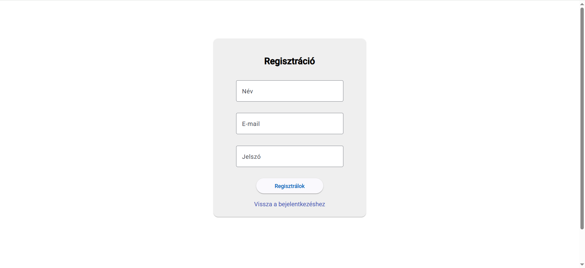
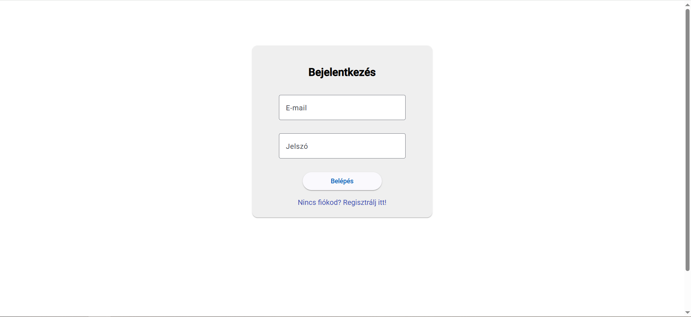
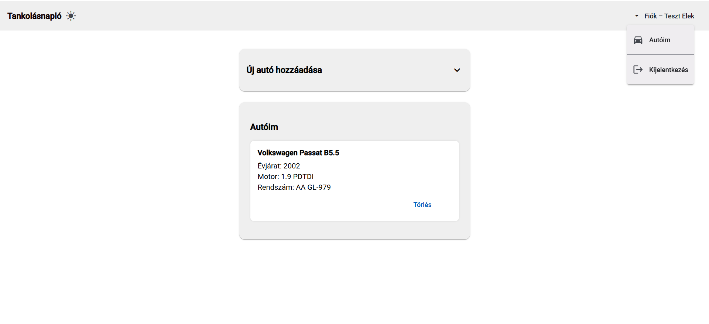
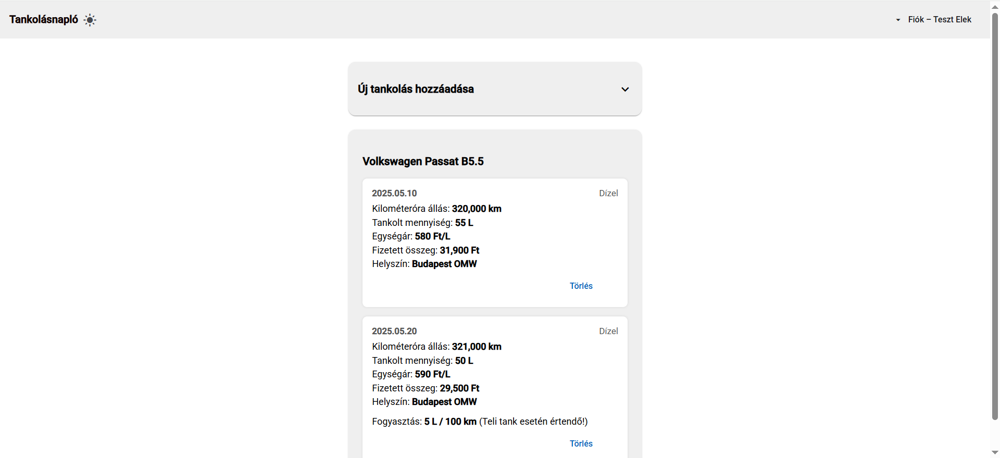

# Webtechnológiák 2 – Beadandó
## Tankolásnapló alkalmazás
A Tankolásnapló egy webes nyilvántartó rendszer, amely segít az autótulajdonosoknak naplózni a tankolási adataikat, kiszámítani az üzemanyag-fogyasztást és nyílvántartani mennyit fizettek a tankolásokkor. Az alkalmazás fejlesztése során a modern MEAN (MongoDB, Express, Angular, Node.js) stack technológiát és Angular Material-t használtam.

---

## Készítette
- **Név:** Szauter Dávid  
- **Neptun kód:** P4QKJP  

---

## Használt programok verziói
- **Node.js** v22.14.0
- **npm** 10.9.2
- **Angular CLI** 19.2.12
- **MongoDB** 2.5.0

---

## Környezeti változók (backend/.env)
```dotenv
PORT=5000
MONGO_URL=mongodb://localhost:27017/beadando
JWT_SECRET=valami_super_titkos_kulcs
```

---

## Funkciók
- Regisztráció és bejelentkezés
- Autók hozzáadása, törlése
- Tankolások rögzítése egy-egy autóhoz
- Átlagfogyasztás számítás
- Token alapú autentikáció (JWT)
- Angular Material felület, világos/sötét téma (még csak az basics)
- Input validáció és formázás

---

## Futtatás

```
cd backend
npm install
node server.js
```

```
cd frontend
npm install
ng serve
```

## Képernyőképek





